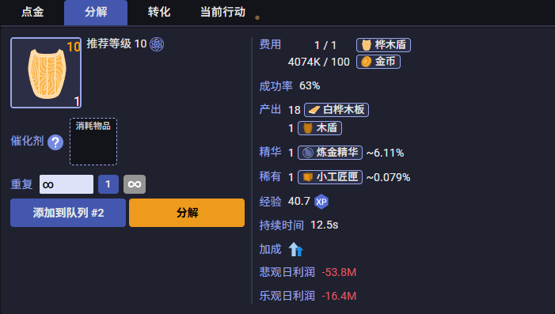
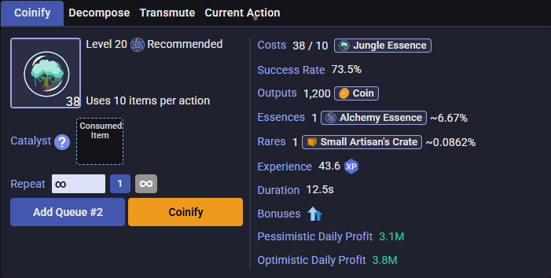

⚠️ 本项目已合并入 [MWI-Production-Gathering-Enhanced]，请前往新仓库获取最新代码与更新：https://github.com/CYR2077/MWI-Production-Gathering-Enhanced
---

# 炼金利润计算器

---

##  依赖说明

> **🚨 重要提醒**：本脚本依赖于[[银河奶牛]自动计算购买材料](https://github.com/CYR2077/MWI-AutoBuyer)，请先安装该脚本。 
> **🚨 Important Notice**: This script depends on [MWI-AutoBuyer](https://github.com/CYR2077/MWI-AutoBuyer). Please install that first.

---

## 功能概述

本工具能够自动计算当前市场价格下的炼金利润期望值，为炼金师提供准确的收益分析。

## 计算特点

### 全面的影响因素考虑
- **全服buff效果**：纳入服务器全局增益效果
- **饮料加成**：计算各种饮料对炼金成功率的提升
- **装备属性**：考虑炼金装备的各项属性加成
- **催化剂效果**：包含催化剂对成功率和品质的影响
- **市场手续费**：扣除交易手续费后的实际收益
- **稀有掉落**：忽略稀有掉落物对收益的影响

### 双重利润模式
- **悲观日利润**：基于左买右卖策略的保守收益估算
- **乐观日利润**：基于右买左卖策略的激进收益估算

## 使用截图

## 💡 重要提醒
 
>  **数学很美好，现实很骨感。这个计算器只能告诉你理论上的收益，实际收益全看老天爷心情**
